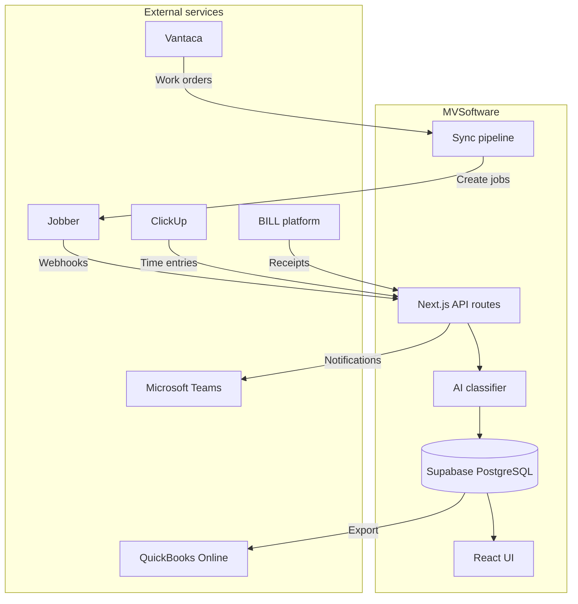

MVSoftware is a Next.js 15 application using the App Router. Each module integrates with external services through dedicated API clients wrapped in resilience patterns, with Supabase as the central data store.

## High-level data flow



## Module boundaries

Each module owns its data layer, types, and API routes:

| Module | Database layer | Types | API routes |
|--------|---------------|-------|------------|
| Vantaca-Jobber | `lib/db.ts` | `lib/types.ts` | `/api/cron`, `/api/webhooks/jobber` |
| TimeTrack | `lib/timetrack-db.ts` | `lib/timetrack-types.ts` | `/api/timetrack/*` |
| Job scrubbing | `lib/scrubbing-db.ts` | `lib/scrubbing-types.ts` | `/api/scrubbing/*` |
| Receipt analysis | `lib/receipt-analysis-db.ts` | Receipt types in db file | `/api/receipt-analysis/*` |
| Teams bot | Teams bot adapter | Bot Framework types | `/api/teams/*` |

## API client architecture

All external API calls go through dedicated client modules with resilience wrappers:

```
Request → Timeout → Retry (exponential backoff + jitter) → Circuit Breaker → External API
```

- **Vantaca**: REST API with credential-based auth (`lib/vantaca-client.ts`)
- **Jobber**: GraphQL API with OAuth (`lib/jobber-client.ts`)
- **ClickUp**: REST API with OAuth (`lib/clickup-client.ts`)
- **QuickBooks**: REST API with OAuth (`lib/qbo-client.ts`)
- **Azure AD**: Microsoft Graph API (`lib/azure-graph.ts`)

See [resilience patterns](/architecture/resilience) for details on retry, circuit breaker, and timeout configuration.

## Authentication flow

```
Azure AD OAuth → NextAuth.js → JWT Session → Middleware → Role-Based Route Protection
```

The middleware validates tokens on every request, refreshes expired tokens automatically, and enforces role-based access on protected routes. See [authentication](/auth/overview) for the full flow.

## Sync orchestration

Scheduled tasks run through cron endpoints authenticated with `CRON_SECRET`:

| Endpoint | Schedule | Purpose |
|----------|----------|---------|
| `GET /api/cron` | Every 5 minutes | Vantaca-Jobber work order sync |
| `POST /api/cron/scrubbing-reconciliation` | Every 15 minutes | Reconcile scrubbing job statuses |
| `POST /api/cron/approval-escalation` | Daily | Escalate overdue approvals |
| `POST /api/cron/daily-reminders` | Daily | Send approval reminder notifications |
| `POST /api/cron/weekly-digest` | Weekly | Generate summary reports |
| `POST /api/cron/receipt-sync` | Hourly | Poll for new receipts |
| `POST /api/cron/teams-notifications` | Every minute | Deliver queued Teams notifications |

## Path aliases

The project uses TypeScript path aliases for clean imports:

```typescript
import { something } from "@/lib/module";     // lib/
import { Component } from "@/components/ui";   // components/
import { mock } from "@/__tests__/factories";  // src/__tests__/
```
