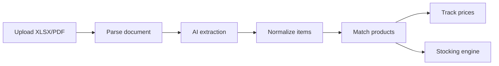

The receipt analysis module extracts line items from BILL platform exports using AI, tracks vendor pricing over time, and generates van stocking recommendations based on usage patterns.

## Pipeline overview

<Steps>
  <Step title="Upload">
    Upload XLSX or PDF receipts exported from the BILL platform.
  </Step>
  <Step title="AI extraction">
    Claude extracts line items from the document: descriptions, quantities, unit prices, and totals. Each item receives a confidence score.
  </Step>
  <Step title="Normalization">
    Extracted items are standardized: descriptions are cleaned, units are normalized, and vendor information is structured.
  </Step>
  <Step title="Product matching">
    Items are matched to canonical products via UPC lookup or semantic search. New products can be added to the library.
  </Step>
  <Step title="Price tracking">
    Matched items update the historical price database, enabling vendor price comparison over time.
  </Step>
  <Step title="Stocking recommendations">
    Usage patterns drive van stocking recommendations: which items to keep on each van and in what quantities.
  </Step>
</Steps>

## Pages

| Page | URL | Description |
|------|-----|-------------|
| Dashboard | `/receipt-analysis` | Upload interface and processing status |
| Receipts | `/receipt-analysis/receipts` | Browse processed receipts |
| Receipt detail | `/receipt-analysis/receipts/[id]` | Individual receipt with raw extraction data |
| Items | `/receipt-analysis/items` | Extracted line items with vendor/category matching |
| Stocking | `/receipt-analysis/stocking` | Van stocking recommendations |

## Key components

| Component | File | Purpose |
|-----------|------|---------|
| Database layer | `lib/receipt-analysis-db.ts` | Receipt and item CRUD |
| Extractor | `lib/receipt-extractor.ts` | Claude-powered document parsing |
| Normalizer | `lib/receipt-normalizer.ts` | Item standardization |
| Document parser | `lib/document-parser.ts` | XLSX/PDF file handling |
| Document storage | `lib/document-storage.ts` | Supabase Storage integration |
| UPC resolver | `lib/upc-resolver.ts` | Product lookup by UPC |
| Price tracker | `lib/price-tracker.ts` | Historical price analysis |
| Stocking engine | `lib/stocking-engine.ts` | Recommendation algorithm |
| Stocking categories | `lib/stocking-categories.ts` | Product taxonomy |
