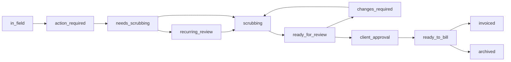

The job scrubbing module provides a Kanban board for reviewing completed Jobber jobs before invoicing. Jobs flow through 11 status stages, with review, client approval, and billing checkpoints.

## Workflow overview

## Status stages

| Status | Description |
|--------|-------------|
| `in_field` | Job is being worked on by field technicians |
| `action_required` | Job needs attention before scrubbing can begin |
| `needs_scrubbing` | Job is ready for initial review |
| `recurring_review` | Recurring job that needs extras/changes check |
| `scrubbing` | Job is actively being reviewed by a scrubber |
| `ready_for_review` | Scrubbing complete, awaiting final review |
| `changes_required` | Reviewer found issues, returned to scrubber |
| `client_approval` | Waiting for client to approve charges |
| `ready_to_bill` | Approved and ready for invoicing |
| `invoiced` | Invoice sent (terminal state) |
| `archived` | Removed from active workflow (terminal state) |

## Key components

| Component | File | Purpose |
|-----------|------|---------|
| Database layer | `lib/scrubbing-db.ts` | CRUD operations for jobs and comments |
| Type definitions | `lib/scrubbing-types.ts` | Status enums, comment types, actions |
| Webhook handler | `lib/scrubbing-webhook.ts` | Jobber webhook integration |
| Reconciliation | `lib/scrubbing-reconciliation.ts` | Status reconciliation with Jobber |

## Pages

| Page | URL | Description |
|------|-----|-------------|
| Kanban board | `/scrubbing` | Main workflow board with all status columns |
| Settings | `/scrubbing/settings` | Client approval configuration |
