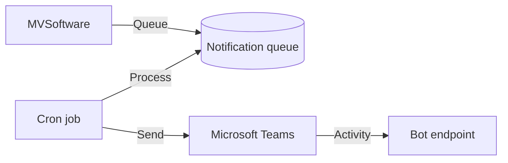

The Teams bot sends notifications to Microsoft Teams channels and users for approval queues, sync failures, and scheduled reports. It uses the Bot Framework SDK (`botbuilder` package) to communicate with the Teams API.

## Notification types

| Type | Trigger | Description |
|------|---------|-------------|
| Approval request | New flagged entry | Notifies the assigned approver of a pending time entry |
| Approval reminder | Daily cron | Reminds approvers of unresolved items in their queue |
| Escalation alert | 3-day deadline | Notifies admins when an approval has been escalated |
| Sync failure | Pipeline error | Alerts when Vantaca-Jobber sync encounters errors |
| Daily digest | Daily cron | Summary of the day's activity across modules |
| Weekly report | Weekly cron | Performance metrics and trends |

## Architecture

Notifications are queued in the `teams_notification_queue` table and delivered by the `teams-notifications` cron job running every minute.

## Key components

| Component | File | Purpose |
|-----------|------|---------|
| Bot adapter | `lib/teams-bot/adapter.ts` | Bot Framework adapter for Teams |
| Bot endpoint | `app/api/teams/bot` | Teams activity handler |
| Bot settings | `teams_bot_service_configuration` table | Webhook URLs and auth config |
| Notification queue | `teams_notification_queue` table | Pending notifications |
