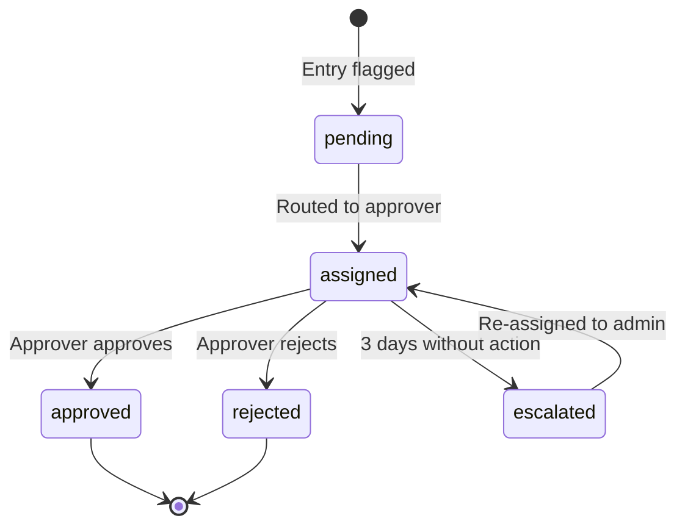

The approval workflow (`lib/approval-workflow.ts`) manages the review process for flagged time entries. Entries with blocking flags are routed to approvers and must be resolved before export.

## Approval flow

## Routing rules

Flagged entries are routed based on the entry author's manager:

1. **Manager-based routing** — the entry is assigned to the author's direct manager (from Azure AD)
2. **Accounting team** — if no manager is available, the entry goes to the accounting group (`MV_ACCOUNTING_GROUP_ID`)
3. **Admin fallback** — if no routing target is found, admins see the entry in their queue

## Escalation

Entries that remain unresolved for 3 days are automatically escalated:
- The `approval-escalation` cron job runs daily
- Escalated entries are reassigned to admins
- Teams bot notifications are sent for escalated items

## Approval actions

| Action | Who | Effect |
|--------|-----|--------|
| Approve | Approver or admin | Resolves all blocking flags, entry becomes exportable |
| Reject | Approver or admin | Entry marked as non-billable with rejection reason |
| Return | Approver or admin | Entry returned to the author for correction |

## API endpoints

| Endpoint | Method | Description |
|----------|--------|-------------|
| `/api/timetrack/approval-status` | GET | Current approval queue metrics (pending, escalated, resolved counts) |
