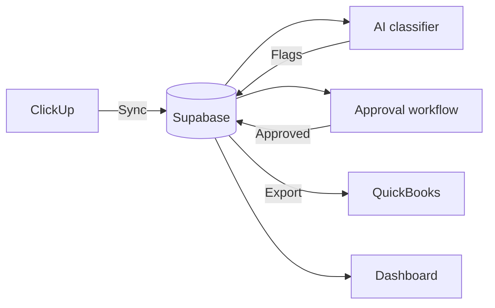

TimeTrack is the largest module in MVSoftware. It pulls time entries from ClickUp, classifies them as billable or non-billable using Anthropic Claude, routes flagged entries through approval workflows, and exports approved entries to QuickBooks Online.

## End-to-end flow

<Steps>
  <Step title="Sync from ClickUp">
    Time entries are polled from configured ClickUp spaces and lists. User data is resolved from Azure AD.
  </Step>
  <Step title="AI classification">
    Each entry is classified as billable or non-billable using Anthropic Claude. Entries receive a confidence score and may be flagged for review.
  </Step>
  <Step title="Billing calculation">
    Billable entries are priced using client-specific rates, multipliers (after-hours premium), and GL code assignments.
  </Step>
  <Step title="Approval routing">
    Flagged entries are routed to approvers based on manager relationships. Overdue approvals escalate after 3 days.
  </Step>
  <Step title="Export to QuickBooks">
    Approved entries are batched and exported to QuickBooks Online with GL codes and client-specific rates.
  </Step>
</Steps>

## Pages

| Page | URL | Description |
|------|-----|-------------|
| Dashboard | `/timetrack` | Main view with filters, summaries, and time entries |
| Approvals | `/timetrack/approvals` | Approval queues for flagged entries |
| Export | `/timetrack/export` | Generate and preview QuickBooks exports |
| Capital projects | `/timetrack/capital-projects` | Fixed asset time allocation |
| Reports | `/timetrack/reports` | RAG-powered semantic search over time data |
| Remediation | `/timetrack/remediation` | Error correction interface |
| Settings | `/timetrack/settings` | Admin configuration |
| Health | `/timetrack/admin/health` | System health diagnostics |
| Accuracy | `/timetrack/admin/accuracy` | AI classifier performance metrics |

## Key components

| Component | File | Size | Purpose |
|-----------|------|------|---------|
| Database layer | `lib/timetrack-db.ts` | 134 KB | All time entry CRUD operations |
| Type definitions | `lib/timetrack-types.ts` | 32 KB | Flags, entries, notes, approvals |
| ClickUp sync | `lib/timetrack-sync.ts` | 43 KB | Polling and entry synchronization |
| AI classifier | `lib/ai-classifier.ts` | 40 KB | Anthropic-powered billability classification |
| Billability engine | `lib/billability-engine.ts` | 51 KB | Rate calculations and multipliers |
| Rate calculator | `lib/rate-calculator.ts` | 30 KB | Client-specific billing rules |
| Export generator | `lib/export-generator.ts` | 49 KB | QuickBooks batch format generation |
| Approval workflow | `lib/approval-workflow.ts` | 14 KB | Entry approval state machine |
| Decision catalogue | `lib/decision-catalogue.ts` | 37 KB | Decision tree guiding AI classification |

## Access control

| Route | Required role |
|-------|--------------|
| `/timetrack/settings` | Admin |
| `/timetrack/export` | Admin |
| `/timetrack/approvals` | Approver or admin |
| All other TimeTrack pages | Any authenticated user |

Viewers can only see their own time entries.
