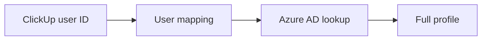

TimeTrack resolves user identities across two systems: ClickUp (where time is logged) and Azure AD (where organizational data lives).

## User resolution flow

1. **ClickUp user ID** comes with each time entry
2. **User mapping** correlates ClickUp IDs to Azure AD identities
3. **Azure AD lookup** via Microsoft Graph (`lib/azure-graph.ts`) provides:
   - Full name, email, job title, department
   - Manager name, email, and ID
   - Direct reports (used for role determination)
   - Group memberships (accounting group for approver role)

## Manager relationships

Manager data from Azure AD drives two features:
- **Role determination**: Users with direct reports receive the `approver` role
- **Approval routing**: Flagged entries are routed to the entry author's manager for review

## Azure AD scopes

The application requests these Microsoft Graph scopes:
- `User.Read` — read the signed-in user's profile
- `Directory.Read.All` — read organizational data (reports, groups, managers)

## Profile caching

User profiles are upserted to Supabase on every login via the NextAuth `signIn` callback. This keeps local profile data current without polling Azure AD separately.

## API endpoints

| Endpoint | Method | Description |
|----------|--------|-------------|
| `/api/timetrack/sync/users` | GET | List all ClickUp team members with their mapped Azure AD data |
