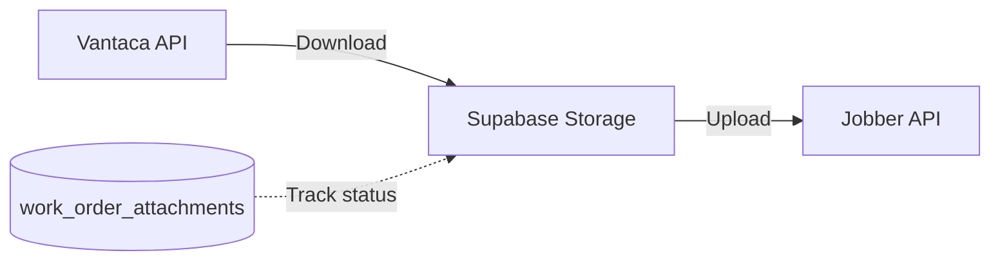

The attachment processor (`lib/attachment-processor.ts`) syncs files from Vantaca work orders to their corresponding Jobber jobs. Attachments pass through Supabase Storage as an intermediate step.

## Sync flow

<Steps>
  <Step title="Discovery">
    During work order sync, the pipeline identifies attachments on each Vantaca work order.
  </Step>
  <Step title="Download from Vantaca">
    Files are downloaded from the Vantaca API and uploaded to Supabase Storage. Metadata is saved to the `work_order_attachments` table.
  </Step>
  <Step title="Upload to Jobber">
    Files are downloaded from Supabase Storage and attached to the corresponding Jobber job via the GraphQL API.
  </Step>
  <Step title="Status tracking">
    Each attachment's sync status is tracked in the database: `pending`, `downloaded`, `uploaded`, `failed`.
  </Step>
</Steps>

## Why the intermediate step

Files pass through Supabase Storage rather than streaming directly from Vantaca to Jobber because:
- Vantaca download URLs may be temporary
- Jobber uploads require specific file formats and metadata
- Failed uploads can be retried without re-downloading from Vantaca
- Provides an audit trail of all synced files

## Error handling

If an attachment fails to upload to Jobber, it remains in Supabase Storage with a `failed` status. The next sync cycle retries failed attachments. The file is only removed from storage after successful upload to Jobber.
