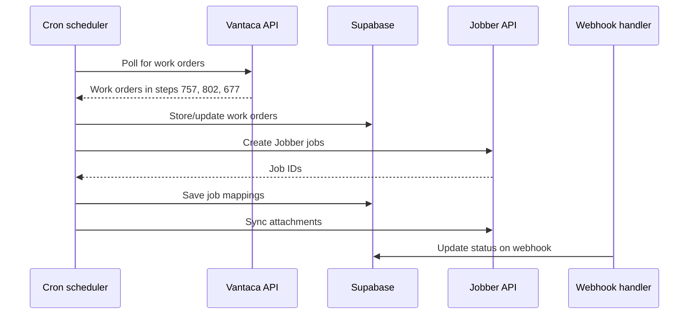

The Vantaca-Jobber sync module automatically creates and updates Jobber jobs from Vantaca work orders. It monitors Vantaca for new work orders in syncable steps, creates corresponding Jobber jobs, syncs attachments, and receives status updates via webhooks.

## How it works

## Syncable work order steps

Only work orders in specific Vantaca steps trigger Jobber job creation:

| Step ID | Description |
|---------|-------------|
| 757 | Process |
| 802 | Awaiting completion |
| 677 | Complete |

Work orders in other steps are monitored but do not create Jobber jobs.

## Key components

| Component | File | Purpose |
|-----------|------|---------|
| Vantaca client | `lib/vantaca-client.ts` | REST API integration with resilience patterns |
| Jobber client | `lib/jobber-client.ts` | GraphQL API with OAuth and custom field management |
| Sync database | `lib/db.ts` | CRUD operations for work orders and job mappings |
| Pipeline | `lib/pipeline/sync.ts` | State machine orchestrating the sync process |
| Attachment processor | `lib/attachment-processor.ts` | Multi-phase file sync between systems |
| Webhook handler | `app/api/webhooks/jobber/route.ts` | HMAC-verified status updates from Jobber |

## Pipeline states

The sync pipeline tracks each work order through a state machine:

| State | Description |
|-------|-------------|
| `monitoring` | Work order discovered, not yet in a syncable step |
| `discovered` | Work order entered a syncable step |
| `stored` | Work order data saved to database |
| `job_created` | Jobber job created and mapping saved |
| `awaiting_completion` | Job active in Jobber, waiting for field completion |
| `closed` | Work order completed |
| `failed` | Sync error occurred (eligible for retry) |

## Next steps

<Columns>
  <Card title="Setup" icon="gear" href="/vantaca-jobber/setup">
    Configure Vantaca credentials and Jobber OAuth.
  </Card>
  <Card title="Pipeline" icon="diagram-project" href="/vantaca-jobber/pipeline">
    Understand the sync state machine in detail.
  </Card>
</Columns>
