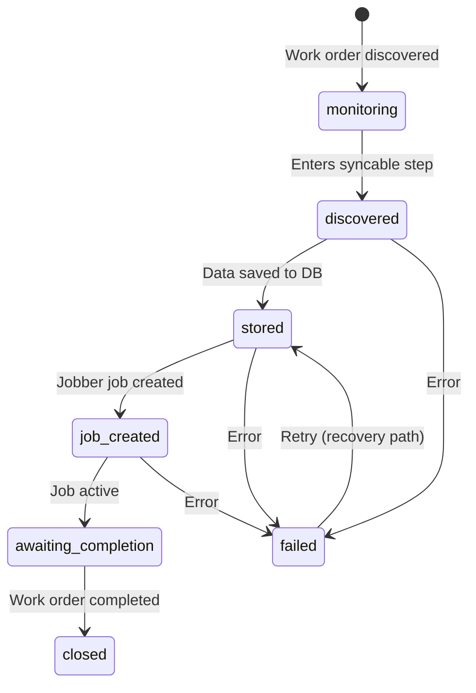

The sync pipeline in `lib/pipeline/` manages the lifecycle of each work order as it flows from Vantaca to Jobber. It uses a state machine pattern with explicit transitions and error recovery.

## State machine

## States

| State | Description | Next states |
|-------|-------------|-------------|
| `monitoring` | Work order exists in Vantaca but is not in a syncable step (757, 802, 677) | `discovered` |
| `discovered` | Work order entered a syncable step, ready for processing | `stored`, `failed` |
| `stored` | Work order data saved to the database | `job_created`, `failed` |
| `job_created` | Jobber job created and XN mapping saved | `awaiting_completion`, `failed` |
| `awaiting_completion` | Job is active in Jobber, waiting for field work | `closed` |
| `closed` | Work order completed in both systems | Terminal state |
| `failed` | An error occurred during processing | `stored` (retry) |

## Step classification

The `classifyStep()` function maps Vantaca step IDs to pipeline states:

| Classification | Result state | Description |
|---------------|-------------|-------------|
| `process` | `stored` | Work order should be actively synced |
| `awaiting` | `awaiting_completion` | Job is in progress |
| `complete` | `closed` | Work order is finished |
| `error` | `failed` | An error state |
| `monitor` | `monitoring` | Not yet syncable |

## Transition functions

Transitions are defined in `lib/pipeline/transitions.ts`:

- **`advanceToStored`**: Recovery path from `discovered` to `stored`. Re-saves work order data after a previous failure.
- **`createJobberJob`**: Advances from `stored` to `job_created`. Creates the Jobber job via GraphQL, sets the XN custom field, and saves the mapping.

Each transition is atomic — if any step fails, the work order remains in its current state and is eligible for retry.

## Sync orchestration

The pipeline runner (`lib/pipeline/runner.ts`) processes work orders in batch:

1. Fetch all work orders from Vantaca
2. For each work order, determine the current pipeline state
3. Apply the appropriate transition
4. Log results and errors to Supabase

The runner is invoked by the cron endpoint (`GET /api/cron`) every 5 minutes.

## Error recovery

Failed work orders are retried on the next sync cycle. The retry endpoint (`POST /api/pipeline/retry`) can also trigger retries for specific work orders, and `POST /api/pipeline/retry-all` retries all failed work orders in batch.

All API calls within transitions use [resilience patterns](/architecture/resilience) (retry with backoff, circuit breaker, timeout).
