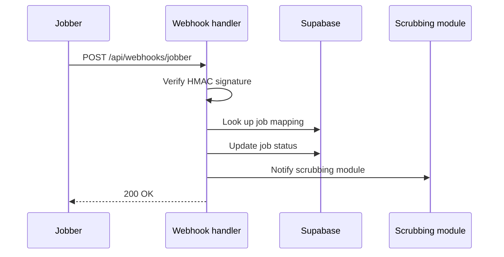

Jobber sends webhooks to MVSoftware when job statuses change. The webhook handler at `POST /api/webhooks/jobber` processes these events and updates the local database.

## Webhook verification

All incoming webhooks are verified using HMAC-SHA256 signature verification:

1. Jobber signs the request body with the webhook secret
2. The handler computes the expected signature
3. If signatures don't match, the request is rejected with 401

This prevents unauthorized parties from sending fake status updates.

## Handled events

The webhook handler processes Jobber job status changes and updates:
- The `jobber_jobs` table with the new status
- The corresponding `vantaca_work_orders` entry
- The scrubbing module (if the job enters a scrubbing-relevant state)

## Event flow



## Error handling

If webhook processing fails, the handler returns a 500 status. Jobber retries failed webhooks automatically. The handler is idempotent — processing the same event twice produces the same result.

## Webhook URL configuration

Register the webhook URL in the Jobber developer portal:

```
https://your-app.vercel.app/api/webhooks/jobber
```

The webhook secret is derived from `JOBBER_CLIENT_SECRET`.
